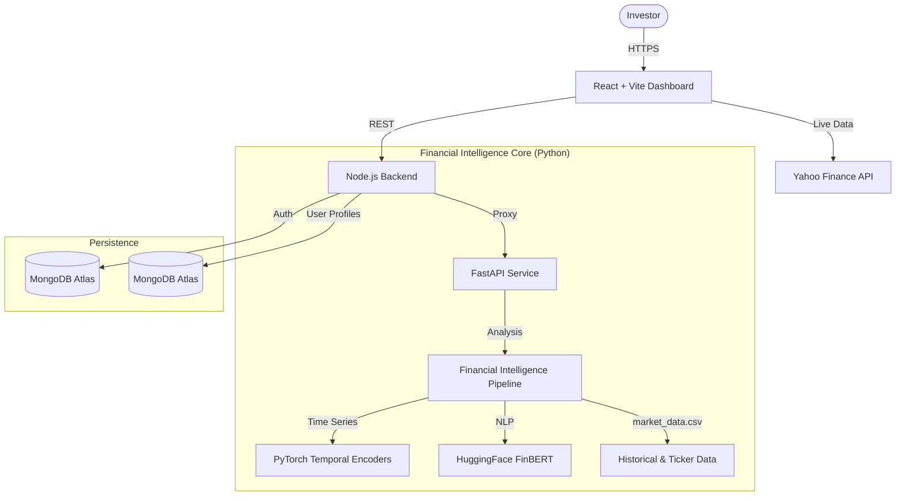
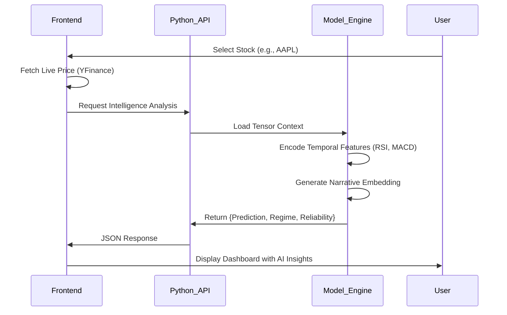

# ⚡ Veritas.ai - Intelligent Market Intelligence Platform

**Unveiling Truth in Financial Noise.**

Veritas.ai is a next-generation financial intelligence platform that fuses **Real-Time Market Data**, **Deep Learning (PyTorch)**, and **Causal Reasoning** to provide investors with actionable insights. Beyond simple price tracking, Veritas helps users understand the *narrative* behind the numbers.

**Stack:** React 19, Node.js, Python (FastAPI/PyTorch/Transformers), Yahoo Finance API, JWT Authentication, MongoDB Atlas.

---

## 🌟 Project Overview

### 🚩 Problem Statement
Retail and institutional investors alike are drowning in data but starving for insight. 
*   **Information Overload**: Live tickers, news feeds, and social sentiment create a noise-to-signal ratio that is impossible for humans to process in real-time.
*   **Reactive Decision Making**: Most tools tell you what *happened*, not what is *likely* to happen or *why* it's happening.
*   **Lack of Context**: Knowing a stock is down 5% is useless without knowing if it's a market-wide correction or a company-specific crisis.

### 🎯 Our Solution
**Veritas.ai** acts as an intelligent co-pilot for financial decision-making.

1.  **AI-Powered Narrative Summaries**: Uses **FinBERT** (Financial BERT) to analyze textual data and generate concise, human-readable explanations for market movements.
2.  **Market Regime Detection**: Automatically classifies the current market state (e.g., *Stable Growth*, *Volatile*, *Crisis*) using deep temporal analysis.
3.  **Reliability Scoring**: Every prediction comes with a confidence score, preventing blind trust in black-box models.
4.  **Live Ecosystem**: Seamlessly blends real-time data from **Yahoo Finance** with our proprietary AI analysis models.

---

## 🏗️ System Architecture

### 🏛️ High-Level Architecture


### 🧠 The Intelligence Pipeline
How we turn raw tickers into wisdom.



---

## ✨ Core Features Explained

### 🚀 Financial Intelligence Pipeline (FIP)
*The brain of Veritas.*

The FIP is a multi-modal analysis engine that processes both numerical and textual data to form a holistic view of an asset.
1.  **Temporal Encoding (Time-Series)**: 
    *   We use a custom **PyTorch** model that ingests a rolling window (default: 30 days) of market data.
    *   Features include OHLCV (Open, High, Low, Close, Volume) and derived technical indicators like **RSI, MACD, and Bollinger Bands**.
    *   These features are passed through an LSTM/GRU-based encoder to capture long-term dependencies and trend momentum.
2.  **Tabular Integration**: 
    *   Static or slowly changing data (Fundamental ratios, Sector classification) is fed into a separate dense network.
    *   This "context vector" is concatenated with the temporal embeddings to provide a baseline for the asset's intrinsic value.
3.  **Narrative Context (NLP)**:
    *   When news is available, we use **FinBERT**, a BERT model fine-tuned on financial sentiment.
    *   It generates a 768-dimensional embedding of the latest market news, which is fused with the numerical data.
    *   *Result:* The model knows *that* the price dropped, and the news tells it *why* (e.g., "CEO Scandal" vs "Market Correction").

### 💼 Portfolio Management System
*Trade. Track. Optimize.*

A comprehensive portfolio management platform with real-time P&L tracking and intelligent trading.

**Core Capabilities:**
*   **Portfolio Creation & Management**:
    *   Create multiple portfolios with customizable initial capital
    *   Soft-delete functionality preserves transaction history
    *   One active portfolio per user for focused trading
*   **Real-Time Trading Engine**:
    *   **Market Order Execution**: Instant buy/sell orders at current market prices
    *   **Validation Layer**: Automatic checks for sufficient funds and holdings
    *   **Position Tracking**: Real-time updates to cash balance and holdings
    *   **Average Cost Calculation**: Intelligent cost basis tracking across multiple purchases
*   **Advanced P&L Calculations**:
    *   **Unrealized P&L**: Live tracking of paper gains/losses on open positions
    *   **Realized P&L**: Historical tracking of locked-in profits from closed positions
    *   **Total Return %**: Overall portfolio performance vs initial capital
    *   **Per-Holding Analytics**: Individual position P&L with percentage breakdowns
*   **Holdings Dashboard**:
    *   Live price updates from intelligence service
    *   Portfolio allocation percentages
    *   Unrealized gains/losses per position
    *   Interactive buy/sell modals with real-time price validation

---

## 🛠️ Technology Stack

### 🧠 AI & Data Science
*   **Python 3.10+**: Core language for intelligence services.
*   **FastAPI**: High-performance async API for model serving.
*   **PyTorch**: Deep learning framework for the FIP model.
*   **Transformers (HuggingFace)**: FinBERT for NLP tasks.
*   **Pandas/NumPy**: Data manipulation and tensor preparation.
*   **Yahoo Finance (yfinance)**: Live user-facing market data.

### 💻 Frontend
*   **React 19**: Latest React features for a responsive UI.
*   **Vite**: Blazing fast build tool.
*   **TailwindCSS**: Utility-first styling with custom glassmorphism effects.
*   **Lucide React**: Beautiful, consistent iconography.
*   **Recharts**: Composable charting library.

### ⚙️ Backend & Infrastructure
*   **Node.js & Express**: Backend API gateway with RESTful endpoints.
*   **JWT & Google OAuth**: Secure, custom authentication with httpOnly cookie sessions and Google Sign-In support.
*   **MongoDB Atlas**: Scalable NoSQL database for user data, portfolios, and transaction history.
*   **Mongoose**: ODM for MongoDB with schema validation and relationship management.
*   **Docker**: Full-stack containerization for consistent deployment.
*   **Redis**: Session management and caching layer.

---

## 🔌 API Endpoints

### Authentication
*   `POST /api/v1/auth/register` - User registration
*   `POST /api/v1/auth/login` - User login with JWT
*   `POST /api/v1/auth/google` - Google OAuth authentication
*   `POST /api/v1/auth/logout` - User logout

### Market Intelligence
*   `GET /api/intelligence/tickers` - Get all available stocks with live prices
*   `GET /api/intelligence/:ticker` - Get AI analysis for a specific stock
*   `GET /api/v1/news/:ticker` - Get latest news for a ticker

### Portfolio Management
*   `POST /api/v1/portfolio` - Create a new portfolio
*   `GET /api/v1/portfolio` - Get active portfolio with summary
*   `DELETE /api/v1/portfolio` - Delete active portfolio
*   `GET /api/v1/portfolio/holdings` - Get detailed holdings information

### Trading
*   `POST /api/v1/orders/market` - Place a market order (buy/sell)
*   `GET /api/v1/orders` - Get order history

---

## 🚀 Quick Start

### Prerequisites
*   Node.js v18+
*   Python 3.10+
*   Docker & Docker Compose (Recommended)

### Installation

1.  **Clone the Repository**
    ```bash
    git clone https://github.com/your-username/veritas.ai.git
    cd veritas.ai
    ```

2.  **Environment Variables**
    Create a `.env` file in the root directory:
    ```env
    # Python Service
    PYTHON_ENV=development
    
    # Node Service
    MONGO_URI=mongodb+srv://...
    ACCESS_TOKEN_SECRET=...
    REFRESH_TOKEN_SECRET=...
    GOOGLE_CLIENT_ID=...
    
    # Frontend
    VITE_GOOGLE_CLIENT_ID=...
    ```

3.  **Run with Docker**
    ```bash
    docker-compose up --build
    ```

---

## 🤝 Team: Veritas.ai

| Name | Role / Area |
| :--- | :--- |
| **Pratyush Raj** | **Project Lead & Backend/ML Architecture** |


---

Made with ❤️ by Veritas.ai Team.
